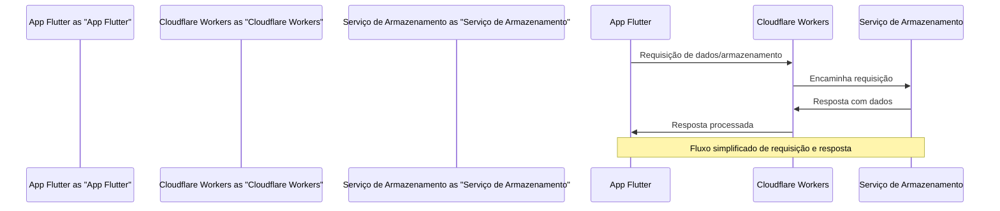

# Diagrama de Sequência do Fluxo de Requisições

Este documento detalha a interação entre o App Flutter, Cloudflare Workers e os serviços de armazenamento utilizados no projeto.

## Participantes
- App Flutter: Cliente que inicia as requisições.
- Cloudflare Workers: Servidor intermediário que gerencia requisições.
- Serviço de Armazenamento: Sistema de armazenamento de dados (ex: R2, S3).

## Fluxo de Requisições

## Descrição do Fluxo
1. O App Flutter inicia uma requisição ao Cloudflare Workers.
2. Cloudflare Workers processa a requisição e a encaminha ao Serviço de Armazenamento apropriado.
3. O Serviço de Armazenamento processa a requisição e retorna a resposta ao Cloudflare Workers.
4. Cloudflare Workers recebe a resposta, podendo aplicar processamentos adicionais se necessário, e encaminha a resposta final ao App Flutter.

## Considerações
- O diagrama simplifica o fluxo, omitindo detalhes de autenticação e tratamento de erros.
- A implementação real deve considerar aspectos de segurança, como autenticação e autorização.
